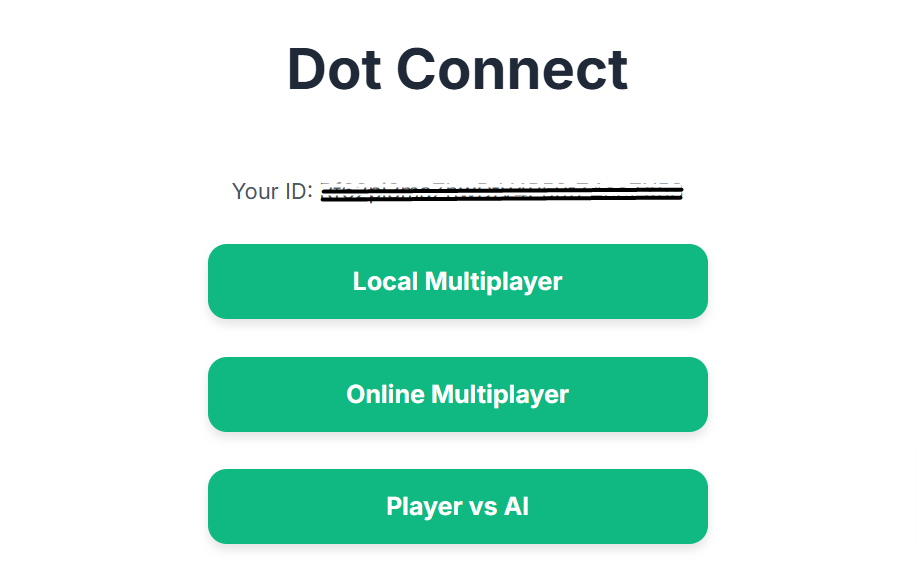

# Dot Connect Game


## About the Project

This is a modern, web-based version of the classic childhood game, Dot Connect (also known as Dots and Boxes). The project is built to showcase a full-stack, real-time multiplayer experience. Players can enjoy local games, challenge an AI, or compete against friends online in a real-time multiplayer lobby.

The core of the game logic is implemented in clean, modular JavaScript, while the real-time functionality is powered by Firebase's Firestore database. The user interface is designed to be clean and intuitive, ensuring a smooth and enjoyable gaming experience.

### Live Demo

You can try the game live here: [DotConnectGame](https://dotconnectgame.netlify.app)

## Features

* **Mode Selection:** Choose to play Local Multiplayer, Player vs AI, or Online Multiplayer.
* **Local Multiplayer:** Play with up to four friends on a single device with customizable player names and grid sizes.
* **Player vs AI:** Test your skills against a smart AI opponent.
* **Online Multiplayer Lobby:**
    * Create a new game with a custom number of players and grid size.
    * Join available games from a list of open challenges.
    * Watch live games being played by others.
    * Find and share games via a unique link.
* **Real-time Synchronization:** Game state, including lines and scores, is synchronized in real-time across all players in an online match.
* **Firebase Integration:** Utilizes Firebase for robust authentication and real-time database management.
* **Leaderboard:** Track and view the scores of top players.
* **Responsive UI:** Designed to provide a great experience on both desktop and mobile devices.

## Tech Stack

* **HTML5**
* **Tailwind CSS:** For rapid UI development and styling.
* **JavaScript (ES6):** For all game logic and front-end interactivity.
* **Firebase:**
    * **Firestore:** Real-time database for managing online game state.
    * **Authentication:** For anonymous and custom token sign-in.
* **Netlify:** For hosting the live demo.

## Getting Started

To get a local copy up and running, follow these simple steps.

### Installation

Clone the repo:
```
git clone https://github.com/Angkon-Kar/Dot-Connect-Game.git
```

Navigate to the project directory:
```
cd Dot-Connect-Game
```

Open index.html with your local web server.


### Contributing
Contributions are what make the open-source community an amazing place to learn, inspire, and create. Any contributions you make are greatly appreciated.

Fork the Project

Create your Feature Branch ```(git checkout -b feature/AmazingFeature)```

Commit your Changes ```(git commit -m 'Add some AmazingFeature')```

Push to the Branch ```(git push origin feature/AmazingFeature)```

Open a Pull Request

## License
Distributed under the [MIT License](https://github.com/Angkon-Kar/LICENSE/blob/main/LICENSE). See LICENSE for more information.
